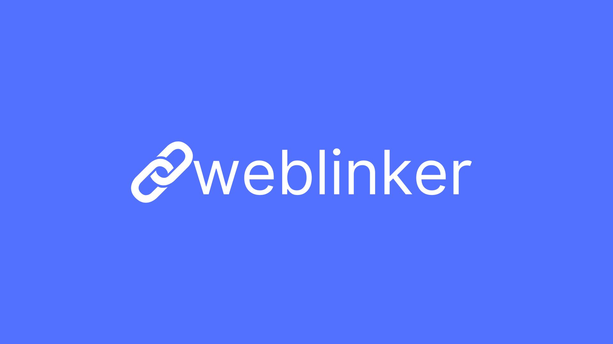

<h1 align="center">
  🔗weblinker
</h1>

  
  
  
  
  

  
  
  

  

# Projeto

**WebLinker** é uma aplicação web moderna que combina o poder do Django para o backend com a eficiência do React no frontend. Projetada para fornecer uma experiência de usuário fluida e interativa, a plataforma centraliza a gestão de recursos e informações através de uma API RESTful robusta.

### Características Atuais

- **Autenticação de Usuários**: O sistema permite o registro e autenticação de usuários.
- **CRUD de Dados**: Os usuários autenticados podem criar, ler, atualizar e deletar dados.

### Tecnologias Utilizadas

- **Django**: Django é um framework de alto nível para Python que incentiva o desenvolvimento rápido e o design limpo e pragmático.
- **Postgres**: Postgres é um sistema de gerenciamento de banco de dados SQL de objeto-relacional.
- **Django Rest Framework**: Django Rest Framework é um poderoso e flexível kit de ferramentas para construir Web APIs.

### Como Executar

1. Clone o repositório
2. Instale as dependências com `pip install -r requirements.txt`
3. Execute as migrações com `python manage.py migrate`
4. Inicie o servidor com `python manage.py runserver`
